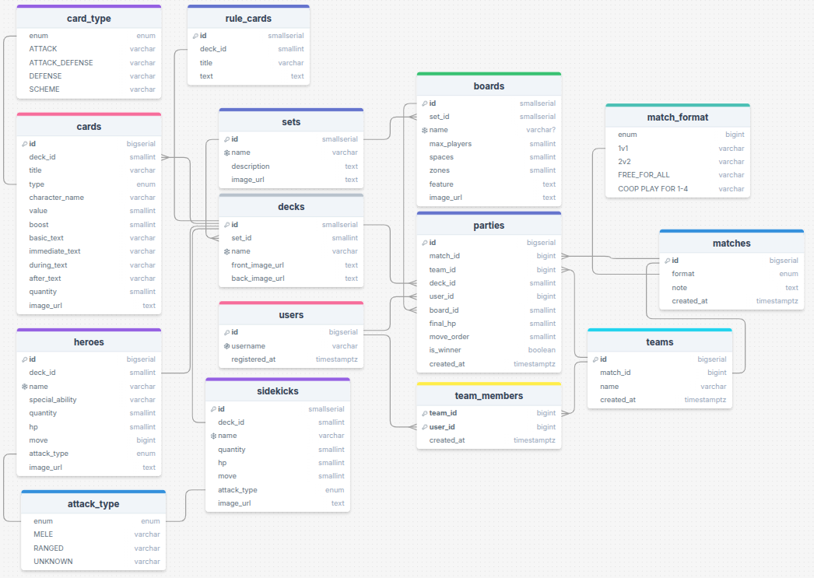

# 🎴 Unmatched Tracker

Unmatched Tracker - web app for the addictive board game **Unmatched**.

## ✨Possibilities✨
- View all game sets, decks, heroes and boards. 
- View information about a specific set. 
- Get a list of decks and cards.
- Manage parties.
- Building top decks by wins
- Good time with deadpool.


## 🛠 Technologies
### Databases
- PostgreSQL
- Redis (caching)

### Backup
- CSV file

### Backend
- Language: Java 21,
- Framework: Spring Boot 3.5.4 (Web, Data JPA, Security),
- ORM: Hibernate.

### Frontend
- Language: Node ts 20,
- Framework: React

### Docker
- Docker Compose

### Cloud Storage
- Cloudinary

## 🚀 Quick start
1. Clone the git repository
```git
git clone https://github.com/Cueerno/UnmatchedTracker.git
```

2. Set up enviroment <br>
Find the file .env.example and rename it to .env and fill it with your data (database password, etc.)

3. Set up Spring <br>
Find the file application-docker.properties.example and rename it to application-docker.properties.

4. Set up Docker Compose
```docker
docker-compose up --build
```

5. Go to your browser and enjoy!

## 🗄 Database diagram
